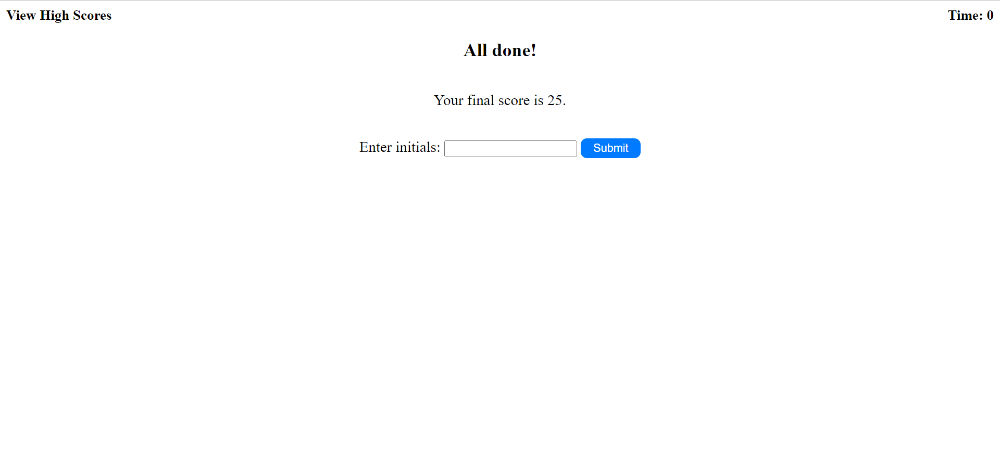

# Title
<Challenge-4_Coding_quiz_challenge>

## Description 
This is a web page that generates 5 questions with 4 choices each , score for each user and high scores saved. This page will run in the browser and will feature dynamically updated HTML and CSS powered by JavaScript code that is written. It will have a clean and polished, responsive user interface that adapts to multiple screen sizes.

 ## Table of contents.
     start button. 
     questions and choices.
     final score shown at the end of the quiz.
     input field to store users initials.
     listing of high scores stored.

 ### 1st page:
 the 1st page will show a descriptive paragraph of how the quiz and scores are counted.
 a start button to to start the quiz and start timer count.

 ### 2nd page to 6th page:
 each page will show a question along with it's choices.

 ### 7th page:
 7th page will show final score and input field to store initials of user.
 submit button to store the initials along with the score in the high scores list.

 ### 8th page:
 8th page will show list of users initials and their scores.
 go back button to start over the quiz.
 clear button to clear all saved scores.

 ## Usage.
  when user open the web page it will show a start button to start the quiz.
  then a timer will start at the top left corner this timer will also represent the score of the user at the end of the quiz.
  once questions are shown user will be able to choose one answer from each of the four choices shown and the a message will show up telling if the choice was correct or wrong.
  after passing all questions user will be redirected to a page showing final score and asking for user to put initials and submit to save the score.
  then user will be redirected again to the last page which shows a list of scores along with initials .
  a go back button to start the quiz again and a clear button to clear all saved scores.

 ## Screenshots.

### Deployed Page Link:
https://nabil1294.github.io/Challenge_4/

## Credits.
clearing previous content in element
https://www.tutorialspoint.com/how-to-clear-all-div-s-content-inside-a-parent-div-in-javascript#:~:text=Using%20the%20innerHTML%20property%20of%20the%20HTML%20element&text=We%20can%20access%20the%20element,elements%20inside%20a%20parent%20div.

button event listener 
https://herewecode.io/blog/create-button-javascript/

timer
https://stackoverflow.com/questions/44314897/javascript-timer-for-a-quiz
https://stackoverflow.com/questions/67496199/javascript-prevent-setinterval-function-from-running-until-button-is-clicked

timeout
https://stackoverflow.com/questions/22655144/how-to-display-a-message-for-a-few-seconds-and-then-disappear-in-javascript

clear timeout
https://code.mu/en/javascript/book/prime/timers/timer-stopping/#:~:text=To%20stop%20the%20timer%2C%20use,the%20timer%20to%20be%20stopped.

local storage
https://www.section.io/engineering-education/how-to-use-localstorage-with-javascript/